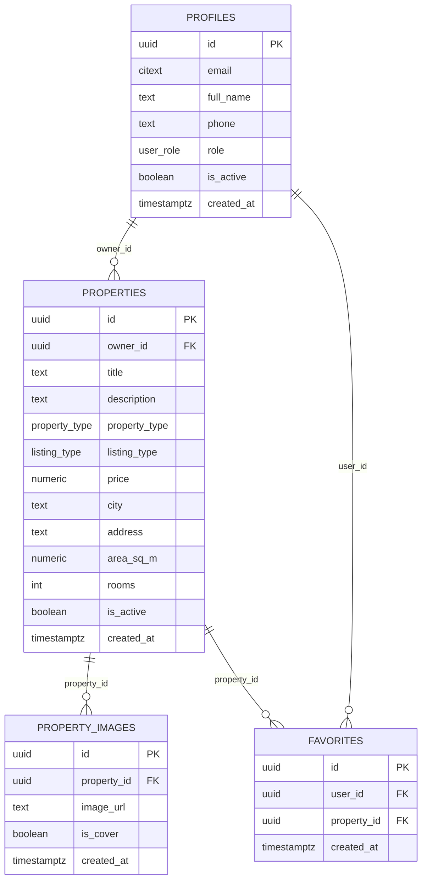

# PropertyMarket

PropertyMarket е уеб приложение за публикуване и разглеждане на обяви за жилищни имоти (продажба и наем), разработено с Vanilla JavaScript и Supabase.

## Описание на проекта

### Какво прави приложението
- Публично разглеждане на активни обяви (без вход).
- Детайли за конкретен имот (цена, площ, стаи, адрес, снимки, описание).
- Регистрация/вход и управление на профил.
- Създаване, редакция, деактивация и изтриване на собствени обяви.
- Добавяне/премахване на обяви в Любими.

### Роли и права
- Гост (невписан): вижда публични обяви и детайли.
- Потребител: създава и управлява собствените си обяви, използва Любими, редактира профил.
- Администратор: има пълен достъп до потребители и всички обяви през Админ панел.
- Неактивен потребител: ограничен за insert/update операции според RLS политиките.

## Архитектура и технологии

### Front-end
- Vanilla JavaScript (ES Modules)
- HTML + CSS + Bootstrap 5 + Bootstrap Icons
- Vite за dev/build
- Hash-based routing (SPA поведение)

### Back-end (BaaS)
- Supabase (PostgreSQL + Auth + Storage)
- Supabase Auth за регистрация, вход и сесии
- Supabase Storage bucket `properties` за снимки
- RLS политики за контрол на достъпа на ниво ред

### Основни технологични зависимости
- `@supabase/supabase-js`
- `vite`

## Дизайн на базата данни

### Основни таблици
- `profiles` — профил към `auth.users` (1:1), роля и статус на потребителя.
- `properties` — обяви за имоти, собственик, тип, цена, локация, площ, стаи, статус.
- `property_images` — снимки към обява (1:N), включително корица.
- `favorites` — many-to-many връзка между потребители и обяви.

### Връзки между таблиците


### Бележки по схемата
- `favorites` има уникално ограничение за двойката `(user_id, property_id)`.
- `property_images` позволява най-много 1 корична снимка на обява (partial unique index).
- Enum типове: `user_role`, `property_type`, `listing_type` (вкл. `studio`).
- Добавени колони `is_active` в `profiles` и `properties` за soft-deactivation.

## Локална среда за разработка

### 1) Изисквания
- Node.js 18+ (препоръчително LTS)
- npm
- Supabase проект (URL + ключ)
- По желание: Supabase CLI (за автоматично прилагане на миграции)

### 2) Инсталация
```bash
npm install
```

### 3) Environment променливи
Създай `.env` в root папката:

```env
VITE_SUPABASE_URL=https://YOUR_PROJECT.supabase.co
VITE_SUPABASE_ANON_KEY=YOUR_ANON_OR_PUBLISHABLE_KEY
```

Допустимо е и:
```env
VITE_SUPABASE_PUBLISHABLE_KEY=YOUR_PUBLISHABLE_KEY
```

### 4) Подготовка на база данни
Изпълни SQL миграциите от `supabase/migrations` в реда на имената им (timestamp order).

Вариант A (Supabase SQL Editor):
- копирай и изпълни файловете последователно.

Вариант B (CLI + скрипт):
```powershell
$env:SUPABASE_ACCESS_TOKEN = "YOUR_SUPABASE_ACCESS_TOKEN"
./scripts/apply-supabase-migrations.ps1 -ProjectRef "YOUR_PROJECT_REF"
```

### 5) Стартиране
```bash
npm run dev
```

### 6) Build за production
```bash
npm run build
npm run preview
```

## Ключови папки и файлове

### Root
- `index.html` — входен HTML шаблон.
- `package.json` — npm скриптове и зависимости.
- `vite.config.js` — конфигурация на Vite.
- `netlify.toml` — настройки за деплой в Netlify.

### `src/`
- `main.js` — стартова точка на front-end приложението.
- `app.js` — инициализира header/footer, router и auth redirect логика.
- `router/router.js` — дефинира маршрутите и guard правила (`requiresAuth`, `requiresAdmin`).
- `components/` — общи UI компоненти (header, footer).
- `pages/` — логика и шаблони за всяка страница (Home, Listings, Details, Create/Edit, Profile, Favorites, Admin и др.).
- `services/supabaseClient/supabaseClient.js` — създава и експортира Supabase client.
- `styles/` — глобални и page-specific стилове.
- `utils/` — помощни функции за рендериране и UI feedback.

### `supabase/`
- `migrations/` — SQL миграции за schema, RLS policies, storage policies и trigger-и.

### `scripts/`
- `apply-supabase-migrations.ps1` — помощен PowerShell скрипт за `supabase db push`.

## Сигурност и контрол на достъпа

- RLS е активиран за `profiles`, `properties`, `property_images`, `favorites`.
- Политиките ограничават write операции до собственик/админ.
- Използват се helper функции като `public.is_admin()`, `public.is_active_user()`, `public.is_user_active()`.
- Публичните потребители виждат само допустимите обяви според активност и политики.

## Статус

Проектът е разработен с учебна цел за курса „Software Technologies with AI“ (SoftUni).
